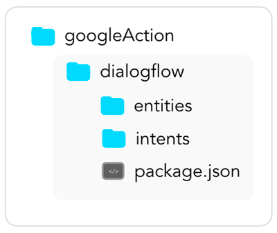

# Platforms

Learn more about the `platforms` folder, which is represents the voice platform projects, including information and language models.

* [Introduction](#introduction)
* [Alexa Skill](#alexa-skill)
    * [.ask](#.ask)
    * [Models](#models)
    * [skill.json](#skilljson)
* [Google Action](#google-action)
    * [Dialogflow](#dialogflow)


## Introduction

The `platforms` folder includes all the information you need to deploy the project to the respective developer platforms Amazon Alexa and Google Assistant.


At the beginning of a new project, the folder doesn't exist until you either import an existing Alexa Skill project with [`jovo get`](../../../02_cli#jovo-get), or initialize the platforms with [`jovo init`](../../../02_cli#jovo-init) and then create the files from the Jovo Language Model with [`jovo build`](../../../02_cli#jovo-build).

If you only want to work with a platform specific model, for example, you want to create just an Alexa Skill, you don't necessarily need the `models` folder: The `platforms` folder and the [`jovo deploy`](../../../02_cli#jovo-deploy) command are enough. Go to [Jovo CLI](../../../02_cli) to learn more about all commands.


## Alexa Skill

The `alexaSkill` folder contains all the information of your Alexa Skill needed to deploy the skill to the Amazon Developer Portal using the [`Jovo CLI`](../../../02_cli).


### .ask
The `.ask` folder contains the `config` file, which has the basic deploy settings of your skill. We recommend you to not make any changes to this file.

```javascript
{
	"deploy_settings": {
		"default": {
			"skill_id": "Your Skill ID",
			"was_cloned": false
		}
	}
}
```

### models

The Alexa Interaction Model is stored in this folder. It can either be built by the [`jovo build`](../../../02_cli#jovo-build) command (if you're making use of the Jovo Language Model), updated manually, or updated in the Amazon Developer Portal and then imported with [`jovo get`](../../../02_cli#jovo-get).

For more information about Alexa Interaction Models, please see the official reference by Amazon: [Custom Interaction Model Reference (Intents, Slots, Sample Utterances)](https://developer.amazon.com/docs/custom-skills/custom-interaction-model-reference.html).

```javascript
{
	"interactionModel": {
		"languageModel": {
			"invocationName": "my test app",
			"types": [],
			"intents": [
				{
					"name": "HelloWorldIntent",
					"samples": [
						"hello",
						"say hello",
						"say hello world"
					]
				},
				{
					"name": "MyNameIsIntent",
					"samples": [
						"{name}",
						"my name is {name}",
						"i am {name}",
						"you can call me {name}"
					],
					"slots": [
						{
							"name": "name",
							"type": "AMAZON.US_FIRST_NAME"
						}
					]
				},
				{
					"name": "AMAZON.CancelIntent",
					"samples": []
				},
				{
					"name": "AMAZON.HelpIntent",
					"samples": []
				},
				{
					"name": "AMAZON.StopIntent",
					"samples": []
				}
			]
		}
	}
}
```

### skill.json

`Skill.json` contains the publication and configuration information of your Skill. This can be either updated manually or in the Amazon Developer Portal (and then imported with the [`jovo get`](../../../02_cli#jovo-get) command).

```javascript
{
	"skillManifest": {
		"publishingInformation": {
			"locales": {
				"en-US": {
					"summary": "Jovo Sample App",
					"examplePhrases": [
						"Alexa open my test app"
					],
					"name": "hello-world",
					"description": "Sample Full Description"
				}
			},
			"isAvailableWorldwide": true,
			"testingInstructions": "Sample Testing Instructions.",
			"category": "EDUCATION_AND_REFERENCE",
			"distributionCountries": []
		},
		"apis": {
			"custom": {}
		},
		"manifestVersion": "1.0"
	}
}
```

## Google Action

The `googleAction` folder currently contains the `dialogflow` (as supported natural language understanding tool) folder with all the files needed to  deploy the agent to Dialogflow Console using the [`Jovo CLI`](../../../02_cli).


Please note that Jovo currently supports **Dialogflow v1**, which means that you can't programmatically create or update your agent. However, the [`jovo deploy`](../../../02_cli#jovo-deploy) command will create a `zip` which you can then import into Dialogflow.

It will be stored inside the `googleAction` folder:


### Dialogflow

The `dialogflow` folder contains the following folders:



#### Intents

All the `intents` are saved in separate files and look like this:

```javascript
{
	"name": "MyNameIsIntent",
	"auto": true,
	"webhookUsed": true,
	"responses": [
		{
			"parameters": [
				{
					"isList": false,
					"name": "name",
					"value": "$name",
					"dataType": "@sys.given-name"
				}
			]
		}
	]
}
```

It is important that `"webhookUsed"` is set to `true` for your Jovo code to be triggered when this intent is called.

The user phrases are added to a different file for each language, e.g. `MyNameIsIntent_usersays_en-us.json`, and look like this:

```javascript
[
	{
		"data": [
			{
				"text": "name",
				"userDefined": true,
				"alias": "name",
				"meta": "@sys.given-name"
			}
		],
		"isTemplate": false,
		"count": 0
	},
	{
		"data": [
			{
				"text": "my name is ",
				"userDefined": false
			},
			{
				"text": "name",
				"userDefined": true,
				"alias": "name",
				"meta": "@sys.given-name"
			}
		],
		"isTemplate": false,
		"count": 0
	},
	{
		"data": [
			{
				"text": "i am ",
				"userDefined": false
			},
			{
				"text": "name",
				"userDefined": true,
				"alias": "name",
				"meta": "@sys.given-name"
			}
		],
		"isTemplate": false,
		"count": 0
	},
	{
		"data": [
			{
				"text": "you can call me ",
				"userDefined": false
			},
			{
				"text": "name",
				"userDefined": true,
				"alias": "name",
				"meta": "@sys.given-name"
			}
		],
		"isTemplate": false,
		"count": 0
	}
```

#### Entities

If you have defined input types, you will find the `entities` in separate folders as well.

#### package.json

This includes some agent specific information. We recommend to not change this file unless you know what you're doing.