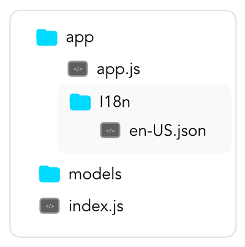

# [App Logic](../) > [Output](./README.md) > i18n

In this section, you will learn how to build voice applications that support multiple languages.

* [Introduction to i18n](#introduction-to-i18n)
* [Configuration](#configuration)
  * [Alternative File Paths](#alternative-file-paths)
  * [i18next Configuration Options](#i18next-configuration-options)
* [Accessing the Content](#accessing-the-content)
* [Advanced i18n Features](#advanced-i18n-features)

## Introduction to i18n

i18n works by separating the content (the text/speech) from the application logic, to make it easier to switch languages.

Jovo uses a package called [i18next](https://www.npmjs.com/package/i18next) to support multilanguage voice apps. You can find all relevant information here: [i18next Documentation](https://www.i18next.com/).

## Configuration

### Standard Configuration

The easiest way to configure i18n is to use the built-in functionality that requires a separate folder for all language resources:



To get started, create a folder called `i18n` in `/app` and add the `languageResources` using the locale ID (e.g. `en-US.json`, `de-DE.json`, `en-GB.json`, etc.). The file structure should look like this:

```javascript
{
  "translation": {
    "WELCOME": "Welcome",
    "WELCOME_WITH_PARAMETER": "Welcome {{firstname}} {{lastname}}",
    "WELCOME_ARRAY": [
      "Welcome",
      "Hey",
      "Hello"
    ]
  }
}
```
You can find out more about how these files are structured here: [i18next Essentials](https://www.i18next.com/essentials.html).

If you follow these conventions, there is no need to additionally add anything to your app configuration.

This is the default configuration for i18next:

```javascript
// Using the constructor
const config = {
    i18n: {
        overloadTranslationOptionHandler: sprintf.overloadTranslationOptionHandler,
        load: 'all',
        returnObjects: true,
    },      
    // Other configurations
};

```

### Alternative File Paths

If you want to add files from a different path, go to `app.js` and add them to the app's configuration.

For example, it could look like this:

```javascript
const de = require('./somePath/de-DE');
const us = require('./somePath/en-US');

let languageResources = {
    'de-DE': de,
    'en-US': us,
}

// Using the constructor
const config = {
    i18n: {
        resources: languageResources
    },      
    // Other configurations
};

// Using the setter
app.setLanguageResources(languageResources);


```

### i18next Configuration Options

You can also add additional configurations that are available for i18next. Those can be added like this:

```javascript
// Using the constructor
const config = {
    i18n: {
        returnNull: false,
        fallbackLng: 'en-US',
    },      
    // Other configurations
};

// Using the setter
app.setLanguageResources(languageResources, { returnObjects: true });
```

You can find a list of [i18next configuration options here](https://www.i18next.com/configuration-options.html).


## Accessing the Content

In your app logic, you can then use `this.t('key')` to access the right string. It is also possible to use parameters with `this.t('key', {parameter: 'value'})`.

Here is some example code for the languageResources object above:

```javascript
app.setHandler({

    'LAUNCH': function() {
        this.tell(this.t('WELCOME'));
    },

    'HelloWorldIntent': function() {
        this.tell(this.t('WELCOME_WITH_PARAMETER', {firstname: 'John', lastname: 'Doe'}));
    },
});
```
You can also use it with the Jovo SpeechBuilder, like so:

```javascript
app.setHandler({

    'LAUNCH': function() {
        let speech = this.speechBuilder()
          .addT('WELCOME');
        this.tell(speech);
    },
});
```

Or with the ready-made speechBuilder object:

```javascript
app.setHandler({

    'LAUNCH': function() {
        this.tell(this.speech.addT('WELCOME'));
    },
});
```

## Advanced i18n Features

If you're using the SpeechBuilder, you can also use arrays inside your `languageResources` for randomized output.

For this, `returnObjects` config for i18next needs to be enabled (default since Jovo Framework `v1.0.0`).

For example, your `languageResources` could look like this:

```javascript
{
  "translation": {
    "WELCOME": [
      "Welcome",
      "Hey",
      "Hello"
    ]
  }
}
```

If you're then using a speechBuilder instance, it will use this array to add variety by returning randomized output:

```javascript
app.setHandler({

    'LAUNCH': function() {
        let speech = this.speechBuilder()
          .addT('WELCOME');
        this.tell(speech);
    },
});
```

So, without changing any of the code in your handlers, you can vary your output by simply adding new elements to your `languageResources`.
