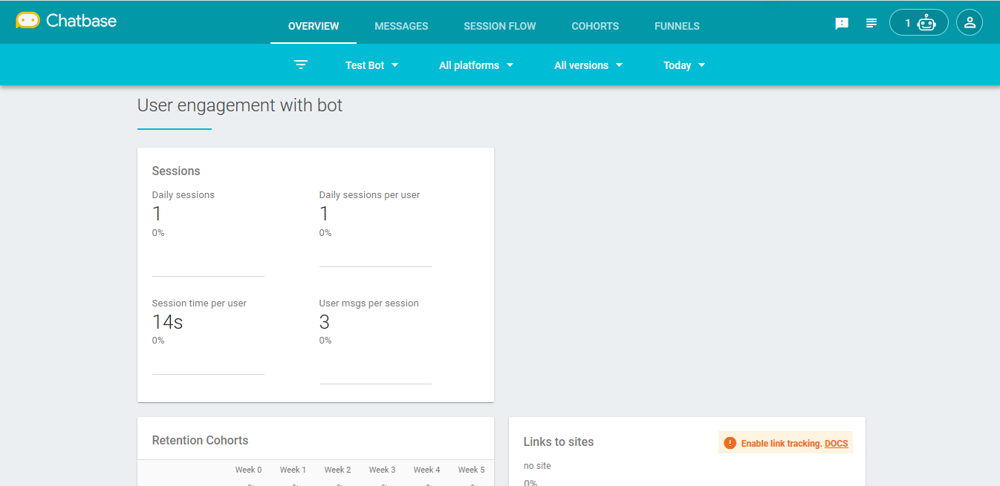

# [Integrations](../) > Analytics

Jovo offers easy analytics integrations and enhancements for VoiceLabs, Dashbot, and Bespoken.

* [Jovo Analytics Layer](#jovo-analytics-layer)
  * [Turn Analytics On and Off](#turn-analytics-on-and-off)
  * [Skip Intents](#skip-intents)
  * [Skip Users](#skip-users)
* [Dashbot](#dashbot)
* [Bespoken](#bespoken)
* [Chatbase](#chatbase)
* [VoiceLabs](#voicelabs) (shut down)


## Jovo Analytics Layer


### Add Analytics Integrations

Analytics for your voice app can be added with one line of code for each analytics vendor and voice platform.

```javascript
// config
const config = {
    /**
     * Other settings
     */
    analytics: {
        services: {
            // Add services here
        },
    },
};
```

You can also use a dedicated method for each analytics vendor and platform:
```javascript

// Dashbot integration
app.addDashbotAlexa(key);
app.addDashbotGoogleAction(key);

// Bespoken integration
app.addBespokenAnalytics(key);

// VoiceLabs integration (shutting down)
app.addVoiceLabsAlexa(key);
app.addVoiceLabsGoogleAction(key);
```

More detailed step-by-step guides can be found here: 

* [Dashbot](#dashbot)
* [Bespoken](#bespoken)
* [Chatbase](#chatbase)
* [VoiceLabs](#voicelabs) (shut down)

The Jovo Analytics class offers several enhancements to the vendor tracking, which can be found in the following sections.

### Turn Analytics On and Off

After adding analytics to your voice app, tracking is enabled by default. You can disable it with the following method:

```javascript
app.analytics().disable();
```

Also, you can enable analytics with this method:

```javascript
app.analytics().enable();
```

### Skip Intents

You can disable tracking for specific intents by adding them as an array like this:

```javascript
app.analytics().skipIntents(intents);
```

### Skip Users

```javascript
app.analytics().skipUsers(userIds);
```

## Dashbot

To use Dashbot Analytics for your voice app, you need to complete the following steps:

1. Create a Dashbot Bot
2. Enable Dashbot Anaytics in your voice app
3. Download the dashbot npm package
4. Test your app

### Create a Dashbot Bot

1. Create a Dashbot account or log in at https://www.dashbot.io.

2. Click “Add a Bot” in the Admin panel:


 
3. Select the right Platform: Alexa for Alexa Skills, or Google for Google Actions (if you are developing for both Amazon Alexa and Google Assistant, please create 2 distinct Dashbot Bots):


4. Copy API Key


### Enable Dashbot Analytics

Dashbot Analytics can be added to your voice app using the config or with the following commands:

```javascript
// config
const config = {
    /**
     * other settings
     */
    analytics: {
        services: {
            DashbotAlexa: {
                key: '<key>',
            },
            DashbotGoogleAction: {
                key: '<key>',
            },
        },
    },
};
// For Dashbot Alexa Bot
app.addDashbotAlexa(key);
​
// For Dashbot Google Bot
app.addDashbotGoogleAction(key);
```

### Download the Dashbot Package

In your terminal, use the following command to download the package via npm:

```
$ npm install dashbot
```

### Test Dashbot

Test your voice app, after a bit your session should appear in the Report section (data is updated hourly):


## Bespoken

To use Bespoken Analytics for your voice app, you need to complete the following steps:

1. Create a Bespoken Dashboard account
2. Enable Bespoken Analytics in your voice app
3. Test your app

### Create a Bespoken Dashboard Account

1. Create a Bespoken account or log in at https://apps.bespoken.io/dashboard/.

2. Click the plus sign on the Home page:


3. Set the name for your source and click on "Create Source"


4. On your source main page, you can see your secret key for that source in the top right corner by clicking "Show"


5. Copy the Secret Key

### Enable Bespoken Analytics

Bespoken Analytics can be added to your voice app using the config or with the following command:

```javascript
// config
const config = {
    /**
     * other settings
     */
    analytics: {
        services: {
            BespokenAlexa: {
                key: '<key>',
            },
            BespokenGoogleAction: {
                key: '<key>',
            },
        },
    },
};
// command
app.addBespokenAnalytics(key);
```

### Test Bespoken

Test your voice app, after a bit your session should appear in the created skill.


## VoiceLabs

> IMPORTANT: VoiceLabs shut down down its service on March 29, 2018. [Read more here](http://voicelabs.co/2018/01/29/voicelabs-exits-analytics-business/).

## Chatbase

To use Chatbase Analytics for your voice app, you need to complete the following steps:

1. Create a Chatbase Bot
2. Enable Chatbase Anaytics in your voice app
3. Test your app

### Create a Chatbase Account

1. Create a Chatbase account or log in at https://chatbase.com/

2. Create a new bot


3. Choose your bot's name and region


4. Copy API Key


### Enable Chatbase Analytics

Chatbase Analytics can be added to your voice app with the following command:

```javascript
// config
const config = {
    /**
     * other settings
     */
    analytics: {
        services: {
            ChatbaseAlexa: {
                key: '<key>',
                version: 'version',
            },
            ChatbaseGoogleAction: {
                key: '<key>',
                version: 'version',
            },
        },
    },
};
// command
app.addChatbaseAnalytics(key);
```

### Test Chatbase

Test you voice app. It can take up to 6 hours until all the data can be seen on the Chatbase dashboard.



<!--[metadata]: {"title": "Analytics Integrations", "description": "Analytics for Alexa Skills and Google Actions with Jovo Integrations", "activeSections": ["integrations", "analytics"], "expandedSections": "integrations", "inSections": "integrations", "breadCrumbs": {"Docs": "framework/docs", "Integrations": "framework/docs/integrations", "Analytics": "" }, "commentsID": "framework/docs/analytics" }-->
