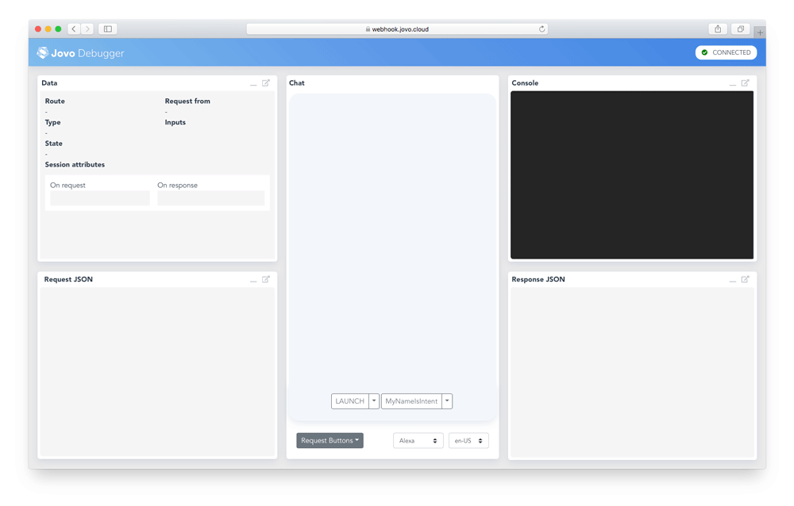

# Jovo Quickstart Guide

Learn how to quickly create a Jovo app for the Amazon Alexa and Google Assistant voice platforms in simple steps. 

* [Install the Jovo CLI](#introduction)
* [Create a new Jovo Project](#create-a-new-jovo-project)
* [Run and Test the Code](#run-and-test-the-code)
* [Next Steps](#next-steps)
   * [Language Model](#language-model)
   * [Routing and App Logic](#routing-and-app-logic)

Watch the video here:

[](https://www.youtube.com/watch?v=DsVVek8exAs)

> [For the full installation guide, take a look here](./installation './installation').

## Install the Jovo CLI

We highly recommend using the Jovo CLI if you want to benefit from all the features coming with Jovo. You can find alternatives on our [installation page](./installation './installation').

Install the Jovo CLI globally with:

```sh
$ npm install -g jovo-cli
```

After successful installation, you should be able to see the Jovo CLI menu by just typing the following into your command line:

```sh
$ jovo
```

You can check the version number (and compare it to the [jovo-cli npm package](https://www.npmjs.com/package/jovo-cli) version) with this command:

```sh
$ jovo -v
```

> [Find a full list of Jovo CLI Commands here](../workflows/cli './cli').


## Create a new Jovo Project

You can create a Jovo project into a new directory with the following command:

```sh
$ jovo new <directory>
```

This will create a new folder, download the [Jovo "Hello World" template](https://www.jovo.tech/templates/helloworld), and install all the necessary dependencies so you can get started right away.

This is how a typical Jovo project looks like:

```javascript
// @language=javascript

models/
  └── en-US.json
src/
  |── app.js
  |── config.js
  └── index.js
project.js

// @language=typescript

models/
  └── en-US.json
src/
  |── app.ts
  |── config.ts
  └── index.ts
project.js
```

> [Find out more about the Jovo project structure here](../configuration/project-structure.md './project-structure').


## Run and Test the Code

To test the logic of your code, you can use the local development server provided by Jovo, and the [Jovo Debugger](../testing/debugger.md './debugger'). 

To get started, use the following command:

```sh
// @language=javascript

$ jovo run

// @language=typescript

$ npm run tsc
$ jovo run
```

This will start the development server on port `3000` and create a Jovo Webhook URL that can be used for local development. Copy this link and open it in your browser to use the [Jovo Debugger](../testing/debugger.md './debugger').



In the Debugger, you can quickly test if the flow of your voice app works. For this example, click on the `LAUNCH` button, and then specify a name on the `MyNameIsIntent` button. The Debugger will create requests and run them agains your local webhook.
 
> [Find out more about requests and responses here](../basic-concepts/requests-responses './requests-responses').


## Next Steps

After getting your first "Hello World," here are the next steps to get started with the Jovo Framework and voice app development.

### Routing and App Logic

Take a look at the `app.js` file in the `src` folder to get an understanding of how the app logic is built:

```js
// @language=javascript

// src/app.js

app.setHandler({
    LAUNCH() {
        return this.toIntent('HelloWorldIntent');
    },

    HelloWorldIntent() {
        this.ask('Hello World! What\'s your name?', 'Please tell me your name.');
    },

    MyNameIsIntent() {
        this.tell('Hey ' + this.$inputs.name.value + ', nice to meet you!');
    },
});

// @language=typescript

// src/app.ts

app.setHandler({
    LAUNCH() {
        return this.toIntent('HelloWorldIntent');
    },

    HelloWorldIntent() {
        this.ask('Hello World! What\'s your name?', 'Please tell me your name.');
    },

    MyNameIsIntent() {
        this.tell('Hey ' + this.$inputs.name.value + ', nice to meet you!');
    },
});
```

> [Find out more about routing here](../basic-concepts/routing './routing').

### Language Model

The handler methods that are referenced in the app logic, e.g. `HelloWorldIntent` and `MyNameIsIntent`, are so called intents that are defined in the app's language model.

Voice platforms offer different types of natural language understanding (NLU) services that offer different schemas. The Jovo Language Model can be used as an abstraction layer that can later be converted into platform-specific models.

> [Find out more about the Jovo Language Model here](../basic-concepts/model './model').


<!--[metadata]: {"description": "Learn how to quickly create a Jovo app for the Amazon Alexa and Google Assistant voice platforms.", "route": "quickstart"}-->
