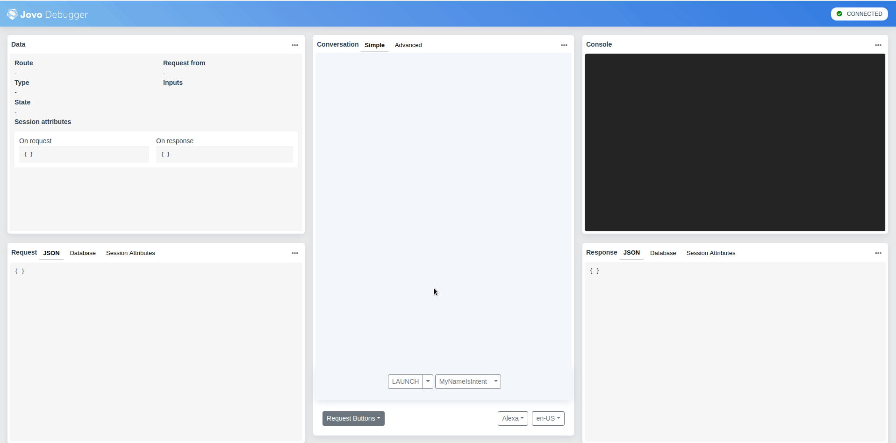

# Debugging

Learn how to effectively debug your Jovo projects by learning which tools you can use and what to look out for.

* [Introduction](#introduction)
* [Jovo Debugger](#jovo-debugger)
* [Jovo Logger](#jovo-logger)
* [Request & Response Logs: What's Important](#request--response-logs-whats-important)

## Introduction

Besides your IDE's debugger, there are two more tools you can use to effectively debug your Jovo projects. First, the Jovo Debugger, that will provide you with all the necessary information about the current state of your Jovo app in every interaction. Second, the Jovo Logger which you can use to not only log your data but also log some of the stuff going on in the background of each Jovo project, e.g. the initialization of plugins, the merging of configurations, etc.

## Jovo Debugger

The Jovo Debugger allows you to debug and quickly test your Jovo app by displaying the most important information about each interaction in one place. That includes the current state of your app (e.g. route, state, inputs, etc.), the request & response and a console window for your logs.



By having the request and the current state of both session attributes and database entries in one place, you can quickly see whether your bugs are caused by unexpected states of your data. 

You can find the detailed explanation of the debugger, its features, and how to use it in the [tools section](../tools/debugger.md '../debugger').

## Jovo Logger

The Jovo framework uses an internal logging class to log the whole process from receiving the request to sending out the response. That includes processing the relevant request data, determining the route, pulling the database entry for the particular user, running the handler function, saving the database entry, parsing the output object, and sending out the response.

Throughout the whole process, the framework logs the key data of each step, but not all of it is shown by default. Depending on your log level some of the information is omitted.

By utilizing the logger, you might find errors in your project's setup, the merging of each plugin's config, the parsing of the output object and more. To learn how to use the Jovo Logger effectively, check out the logging page in the [basic concepts section](../basic-concepts/data/logging.md#jovo-logger '../data/logging#jovo-logger').

## Request & Response Logs: What's Important

The cause of many of the basic errors you might encounter can be identified by having a closer look at the request and response JSON.

For example, if an unexpected intent is triggered or the received input string is different than you expected, you should have a look at the respective properties in the incoming request.

In the case of Alexa, you can find it in the request's `request` object:

```js
{
  // ...
  "request": {
    "type": "IntentRequest",
    "requestId": "amzn1.echo-api.request.5c96e32a-d803-4ba0-ba04-4293ce23ggf1",
    "timestamp": "2017-07-03T09:56:44Z",
    "locale": "en-US",
    "intent": {
      "name": "HelloWorldIntent",
      "confirmationStatus": "NONE"
    }
  }
}
```

Besides basic things like intent name and inputs, you get useful information like the supported interfaces of the device from which the request comes from.

In the case of Google Action requests, you can find it available interfaces (called surfaces) under the following path: `originalDetectIntentRequest.payload.surface`

```js
{
  // ...
  "surface": {
    "capabilities": [
      {
        "name": "actions.capability.MEDIA_RESPONSE_AUDIO"
      },
      {
        "name": "actions.capability.SCREEN_OUTPUT"
      },
      {
        "name": "actions.capability.AUDIO_OUTPUT"
      },
      {
        "name": "actions.capability.WEB_BROWSER"
      }
    ]
  },
}
```

Generally, you should have a good understanding of the different types of requests you receive from each platform and what kind of data they parse with each request as these are the foundation of each interaction.

<!--[metadata]: {"description": "Learn how to effectively debug your Jovo projects.", "route": "debugging"}-->
