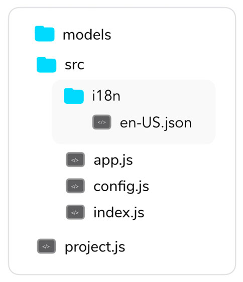

# i18next CMS Integration

> To view this page on the Jovo website, visit https://www.jovo.tech/marketplace/jovo-cms-i18next

In this section, you will learn how to build voice applications that support multiple languages.

* [Introduction to i18n](#introduction-to-i18n)
* [Configuration](#configuration)
  * [Standard Configuration](#standard-configuration)
  * [Alternative File Paths](#alternative-file-paths)
  * [i18next Configuration Options](#i18next-configuration-options)
* [Accessing the Content](#accessing-the-content)
* [Advanced i18n Features](#advanced-i18n-features)
  * [Randomized Output](#randomized-output)
  * [Platform-specific Responses](#platform-specific-responses)
* [CMS Integrations](#cms-integrations)

## Introduction to i18n

i18n works by separating the content (the text/speech) from the application logic, to make it easier to switch languages.

Jovo uses a package called [i18next](https://www.npmjs.com/package/i18next) to support multilanguage voice apps. You can find all relevant information here: [i18next Documentation](https://www.i18next.com/).

## Configuration

### Standard Configuration

The easiest way to configure i18n is to use the built-in functionality that requires a separate folder for all language resources:



To get started, create a folder called `i18n` in `/app` and add the `languageResources` using the locale ID (e.g. `en-US.json`, `de-DE.json`, `en-GB.json`, etc.). The file structure should look like this:

```javascript
{
  "translation": {
    "welcome": "Welcome",
    "welcome_with_parameter": "Welcome {{firstname}} {{lastname}}",
    "welcome_array": [
      "Welcome",
      "Hey",
      "Hello"
    ],
    "welcome_nested": {
        "speech": "You can access this with welcome_nested.speech",
        "reprompt":  "You can access this with welcome_nested.reprompt"
    }
  }
}
```
You can find out more about how these files are structured here: [i18next Essentials](https://www.i18next.com/essentials.html).

If you follow these conventions, there is no need to additionally add anything to your app configuration.


### Alternative File Paths

If you want to add files from a different path, you can do so in your `config.js` file:

For example, it could look like this:

```javascript
// @language=javascript

// src/config.js

module.exports = {
    
    i18n: {
        resources: {
            'en-US': require('./path/to/files/en-US'),
            'de-DE': require('./path/to/files/de-DE'),
        }
    }, 

    // ...

};

// @language=typescript

// src/config.ts

const config = {
    
    i18n: {
        resources: {
            'en-US': require('./path/to/files/en-US'),
            'de-DE': require('./path/to/files/de-DE'),
        }
    }, 

    // ...

};
```

Also possible:

```javascript
// @language=javascript

// src/config.js

module.exports = {
    
    i18n: {
        filesDir: './path/to/files/',
    }, 

    // ...

};

// @language=typescript

// src/config.ts

const config = {
    
    i18n: {
        filesDir: './path/to/files/',
    }, 

    // ...

};
```


### i18next Configuration Options

You can also add additional configurations that are available for i18next. Those can be added like this:

```javascript
// @language=javascript

// src/config.js

module.exports = {
    
    i18n: {
        returnNull: false,
        fallbackLng: 'en-US',
    }, 

    // ...

};

// @language=typescript

// src/config.ts

const config = {
    
    i18n: {
        returnNull: false,
        fallbackLng: 'en-US',
    }, 

    // ...

};
```

> You can find a list of [i18next configuration options here](https://www.i18next.com/configuration-options.html).


## Accessing the Content

In your app logic, you can then use `this.t('key')` to access the right string. It is also possible to use parameters with `this.t('key', {parameter: 'value'})`.

Here is some example code for the languageResources object above:

```javascript
// @language=javascript

// src/app.js

app.setHandler({

    LAUNCH() {
        this.tell(this.t('welcome'));
    },

    HelloWorldIntent() {
        this.tell(this.t('welcome_with_parameter', {firstname: 'John', lastname: 'Doe'}));
    },
});

// @language=typescript

// src/app.js

app.setHandler({

    LAUNCH() {
        this.tell(this.t('welcome'));
    },

    HelloWorldIntent() {
        this.tell(this.t('welcome_with_parameter', {firstname: 'John', lastname: 'Doe'}));
    },
});
```
You can also use it with ready-made speechBuilder object:

```javascript
app.setHandler({

    LAUNCH() {
        this.$speech.addT('welcome');

        this.tell(this.$speech);
    },
});
``` 

Or by creating a new SpeechBuilder object, like so:

```javascript
app.setHandler({

    LAUNCH() {
        let speech = this.speechBuilder()
          .addT('welcome');
        this.tell(speech);
    },
});
```


## Advanced i18n Features

Jovo offers advanced i18n features that are specifically built for voice and conversational interfaces:

* [Randomized Output](#randomized-output)
* [Platform-specific Responses](#platform-specific-responses)

### Randomized Output

If you're using the SpeechBuilder, you can also use arrays inside your `languageResources` for randomized output.

For this, `returnObjects` config for i18next needs to be enabled (default since Jovo Framework `v1.0.0`).

For example, your `languageResources` could look like this:

```javascript
{
  "translation": {
    "welcome": [
      "Welcome",
      "Hey",
      "Hello"
    ]
  }
}
```

If you're then using a speechBuilder instance, it will use this array to add variety by returning randomized output:

```javascript
app.setHandler({

    LAUNCH() {
        this.$speech.addT('welcome');

        this.tell(this.$speech);
    },
});
```

So, without changing any of the code in your handlers, you can vary your output by simply adding new elements to your `languageResources`.

### Platform-specific Responses

Since Jovo `v2.1.4`, we support platform-specific responses for i18n, as well as for CMS. This feature uses the app type (e.g. `AlexaSkill`, `GoogleAction`) as [i18n namespace](https://www.i18next.com/principles/namespaces): 

Adding namespaces like below to your language resources allows you to have isolated output for a specified platform, without altering the default one or updarting the code logic.

```javascript 
{
    "translation": {
        "welcome": "Welcome.",
        "goodbye": "Goodbye."
    },
    "AlexaSkill": {
        "translation": {
            "goodbye": "Feel free to rate this skill, have a wonderful day."
        }
    },
    "GoogleAction": {
        "translation": {
            "goodbye": "/"
        }
    }
}
```

In this example, the value for `goodbye` will be overwritten, whenever a response is triggered by Alexa. `welcome` remains the same for all platforms.

If you don't want any output for a specific platform, use `/`.

## CMS Integrations

You can also use these i18n features with the [Jovo CMS Integrations](https://www.jovo.tech/docs/cms) like [Google Sheets](https://www.jovo.tech/marketplace/jovo-cms-googlesheets) and [Airtable](https://www.jovo.tech/marketplace/jovo-cms-airtable).