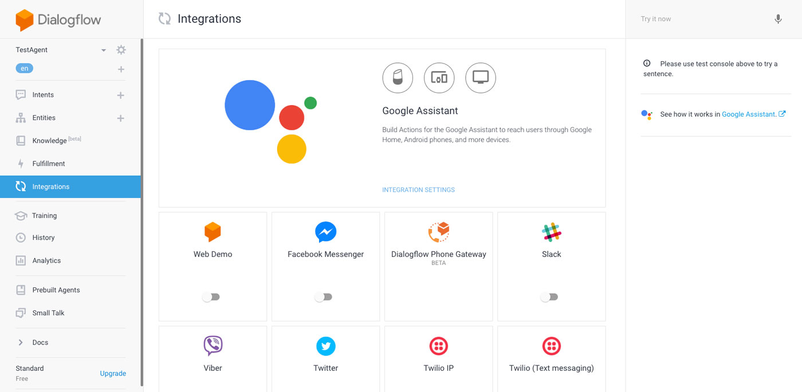
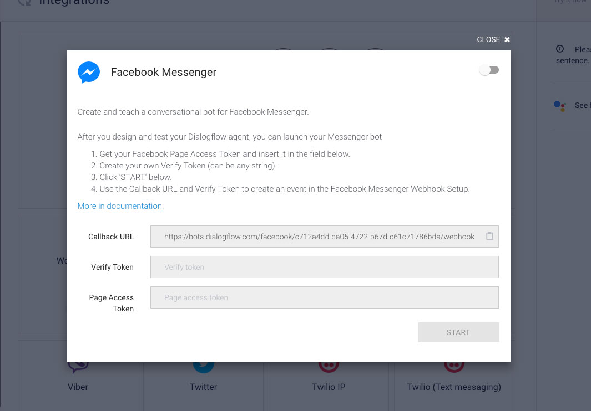
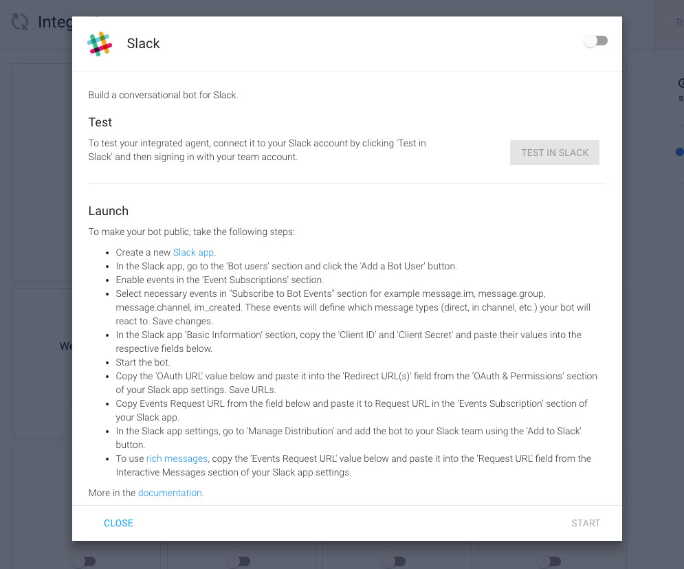

# Dialogflow Platform Integration

> To view this page on the Jovo website, visit https://www.jovo.tech/marketplace/jovo-platform-dialogflow

Learn how to bring your Jovo apps to platforms like Facebook Messenger and Slack by using Dialogflow integrations.

* [Introduction to Dialogflow Integrations](#introduction-to-dialogflow-integrations)
* [Configuration](#configuration)
* [Platforms](#platforms)
   * [Facebook Messenger](#facebook-messenger)
   * [Slack](#slack)
* [Custom Payloads](#custom-payloads)


## Introduction to Dialogflow Integrations

If you have an existing Dialogflow Agent (which you can set up using the [Jovo Language Model](https://www.jovo.tech/docs/model)) and the [Jovo CLI](https://www.jovo.tech/docs/cli), you can enable integrations in the [Dialogflow console](https://console.dialogflow.com/):




## Configuration

To enable a Dialogflow integration in your code, import the `jovo-platform-dialogflow` package and then register the integrations with the `app.use` method:

```js
// @language=javascript

// src/app.js

const { Dialogflow, FacebookMessenger, Slack } = require('jovo-platform-dialogflow');

app.use(
    new Dialogflow().use(
        new Slack(),
        new FacebookMessenger()
    )
);

// @language=typescript

// src/app.ts

import { Dialogflow, FacebookMessenger, Slack } from 'jovo-platform-dialogflow';

app.use(
    new Dialogflow().use(
        new Slack(),
        new FacebookMessenger()
    )
);
```

The example above shows how both Slack and Facebook Messenger are added as plugins of the Dialogflow class, with an additional `use` call.


## Platforms

* [Facebook Messenger](#facebook-messenger)
* [Slack](#slack)

### Facebook Messenger

> Official Dialogflow Docs: [Facebook Messenger Integration](https://dialogflow.com/docs/integrations/facebook)



You can use this Dialogflow integration to build bots for Facebook Messenger. Learn more about the setup process in the [official Dialogflow docs](https://dialogflow.com/docs/integrations/facebook).

For platform-specific output, you can add custom payload ([learn more below](#custom-payloads)) with the `facebook` attribute. Learn more about Facebook Messenger output in the [official Facebook docs](https://developers.facebook.com/docs/messenger-platform/send-messages).


### Slack

> Official Dialogflow Docs: [Slack Integration](https://dialogflow.com/docs/integrations/slack)



You can use this Dialogflow integration to build Slack bots. Learn more about the setup process in the [official Dialogflow docs](https://dialogflow.com/docs/integrations/slack).

For platform-specific output, you can add custom payload ([learn more below](#custom-payloads)) with the `slack` attribute. Learn more about Slack bot output in the [official Slack docs](https://api.slack.com/messaging/composing).


## Custom Payloads

> Official Dialogflow Docs: [Custom Payloads](https://dialogflow.com/docs/intents/rich-messages#custom_payload)

To extend the responses with platform-specific output, you can add [custom payloads](https://dialogflow.com/docs/intents/rich-messages#custom_payload) to the Dialogflow response:

```js
// @language=javascript

this.$dialogflowAgent.setCustomPayload(platform, payload)

// @language=typescript

this.$dialogflowAgent!.setCustomPayload(platform: string, payload: object)
```

You can find the right attributes to pass to the method in the [official Dialogflow docs](https://dialogflow.com/docs/intents/rich-messages#custom_payload). For example, you can add [Facebook Messenger Quick Replies](https://developers.facebook.com/docs/messenger-platform/send-messages/quick-replies) like this:

```js
// @language=javascript

// src/app.js

app.setHandler({

   HelloWorldIntent() {
      this.$dialogflowAgent.setCustomPayload('facebook', {
         "quick_replies": [
               {
                  "content_type": "text",
                  "title": "Joe",
                  "payload": "Joe",
               },
               {
                  "content_type": "text",
                  "title": "Samantha",
                  "payload": "Samantha",
               },
               {
                  "content_type": "text",
                  "title": "Chris",
                  "payload": "Chris",
               }
         ]
      });
      this.ask('Hello World! What\'s your name?', 'Please tell me your name.');
   },

   // ...

});

// @language=typescript

// src/app.ts

app.setHandler({

   HelloWorldIntent() {
      this.$dialogflowAgent!.setCustomPayload('facebook', {
         "quick_replies": [
               {
                  "content_type": "text",
                  "title": "Joe",
                  "payload": "Joe",
               },
               {
                  "content_type": "text",
                  "title": "Samantha",
                  "payload": "Samantha",
               },
               {
                  "content_type": "text",
                  "title": "Chris",
                  "payload": "Chris",
               }
         ]
      });
      this.ask('Hello World! What\'s your name?', 'Please tell me your name.');
   },

   // ...

});
```